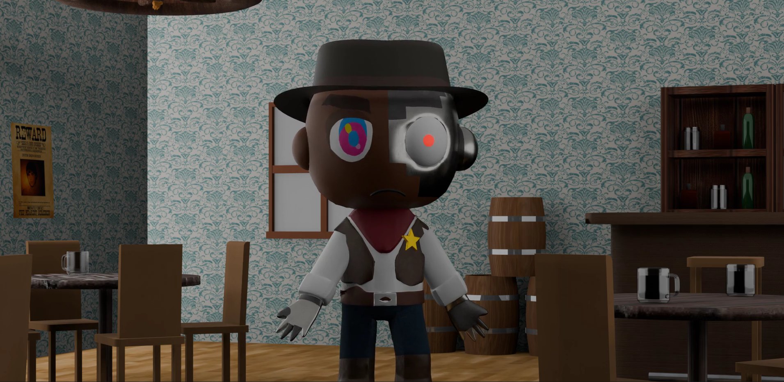

# Diseño y animación 3D — Cowboys

Diseño de personajes cyborg-cowboy de principio a fin: identidad visual, historia, modelado, texturizado, rigging y animación 3D.

## Qué hace

- Design Book con la identidad visual del personaje.
- Historia «Salvaje y Mecánico Oeste», con una ficha por personaje.
- Model sheet y render final del personaje en 3D.

## Contenido

| Fichero | Qué es |
|---|---|
| `Such Andreu, Enrique - Design Book.pdf` | Design Book |
| `Diseno-de-personajes/` | Arquetipos, historia y fichas de personajes |
| `modelsheet.png` | Model sheet del personaje |
| `render-personaje-3d.png` | Render final |

> Los ficheros 3D pesados (`.blend`) y los vídeos no están subidos por el límite de tamaño de GitHub; disponibles bajo petición.

---

Asignatura de Diseño Gráfico (DIGRAF), Grado en Tecnología Digital y Multimedia (UPV). Forma parte de mi [portfolio](https://quique-such.github.io/portafolio/).
